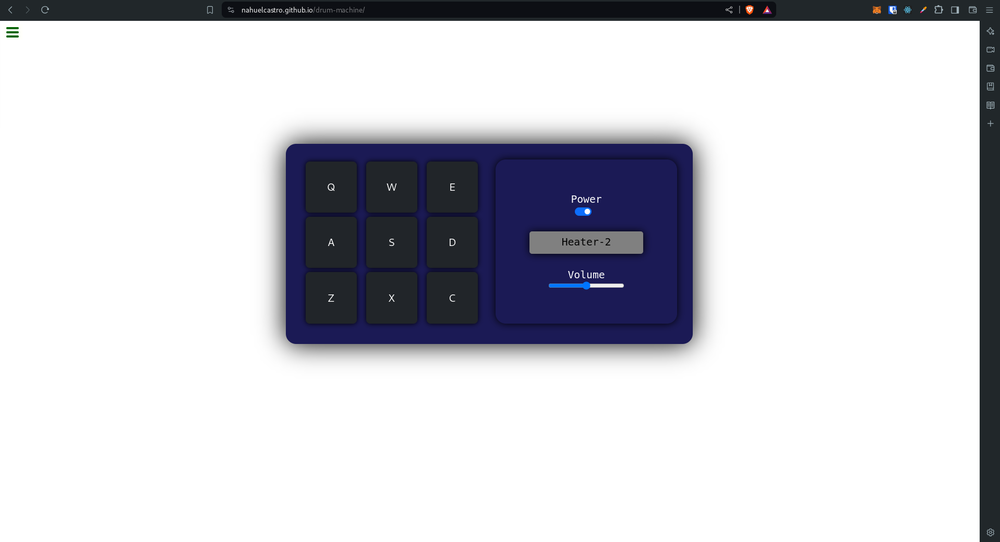
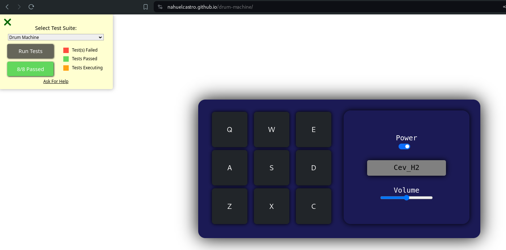

# Markdown Previewer

## Second Project for frontend libraries certification in freecodecamp

### Objective

Recreate the markdown previewer project using React.
https://www.freecodecamp.org/learn/front-end-development-libraries/front-end-development-libraries-projects/build-a-javascript-calculator

- Obtained Score: 8/8

### Live Demo

- https://nahuelcastro.github.io/drum-machine/
- Screenshots:
  
  

### How to run

1. Clone this repository
2. Run `npm install`
3. Run `npm start`
4. Open `http://localhost:3000` in your browser
5. Enjoy!

